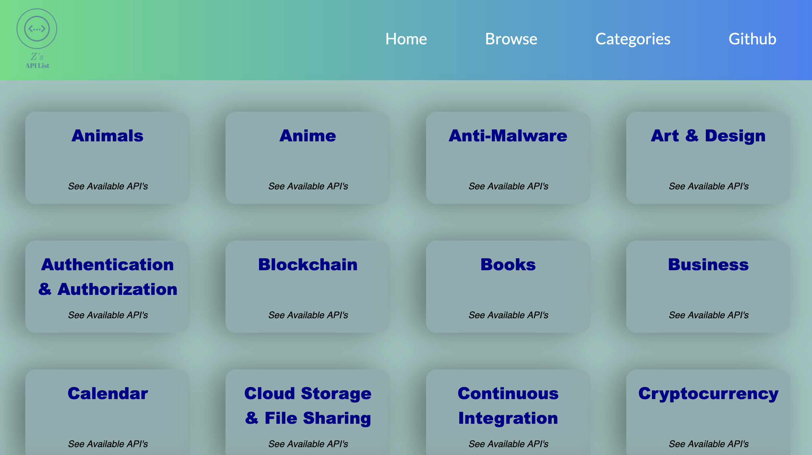
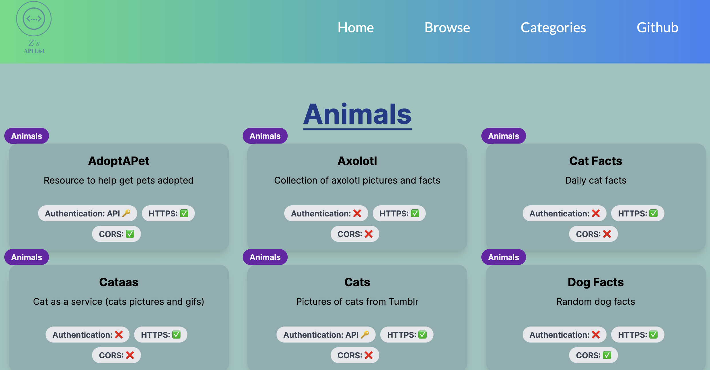

# API-List
A list of API's for me to get inspiration from while coding. Lots of categories this list has everything from pet pictures to wall street API's to help build new projects and utilize new tools. 

      

---

 ## Table of Contents:
  - [Information](#information)
  - [License](#license)
  - [Contributions](#contributions)
  - [Links](#links)
  - [Repo](#repo)

## Information

This is a list of API's that I have used or want to use in the future. I will be adding to this list as I find more API's that I like.

I used this API to create this site: https://github.com/davemachado/public-api 

---

## License

N/A

## Contributions

N/A

All contributions were done by me, outside from the api that I used to create this site.
If you would like to contribute to this project, feel free to fork the repo and make a pull request with your changes.

## Screenshot of finished page

---

# LINKS

## Link to Page
https://api-list-woad.vercel.app/

## Repo
https://github.com/Zcordeiro/API-List

